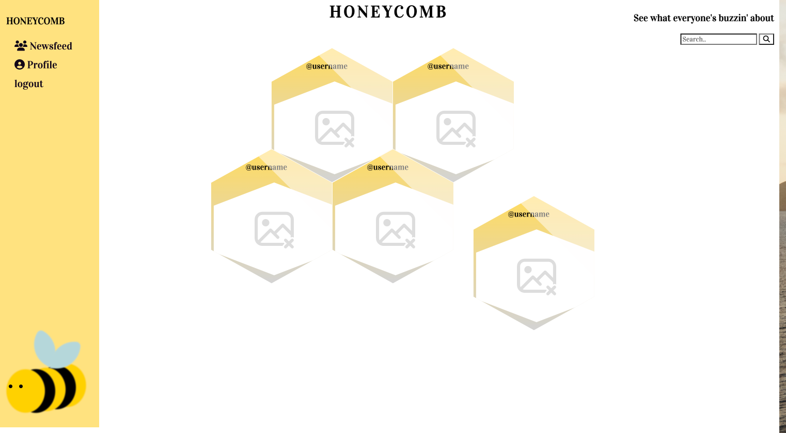
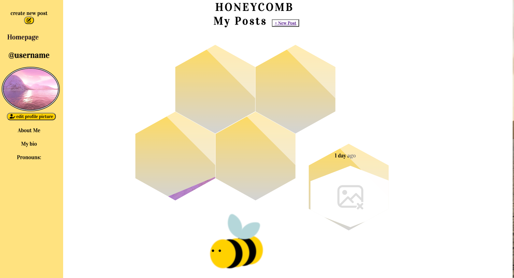

# the-honey-comb

## Description

* Honey Comb is a social media application with innovative simplicity and creativity. This is a place for people to share the on-goings and interest of their lives along with creative freedom to cusomize their profile page.

## Table of Contents 

- [Usage](#usage)
- [Credits](#credits)
- [links](#links)
- [Questions](#questions)
- [License](#license)

## Usage
​
​
​

## Credits

* Carly Gallagher
* Ariana Coia
* Myleen Santana
* Samantha Orozco
* Andra Mays

## Links

https://github.com/CarlyGallagher/the-honey-comb.git

## Questions
If you have any questions feel free to reach me at
Github Username: 
- https://github.com/CarlyGallagher

## License

MIT License
